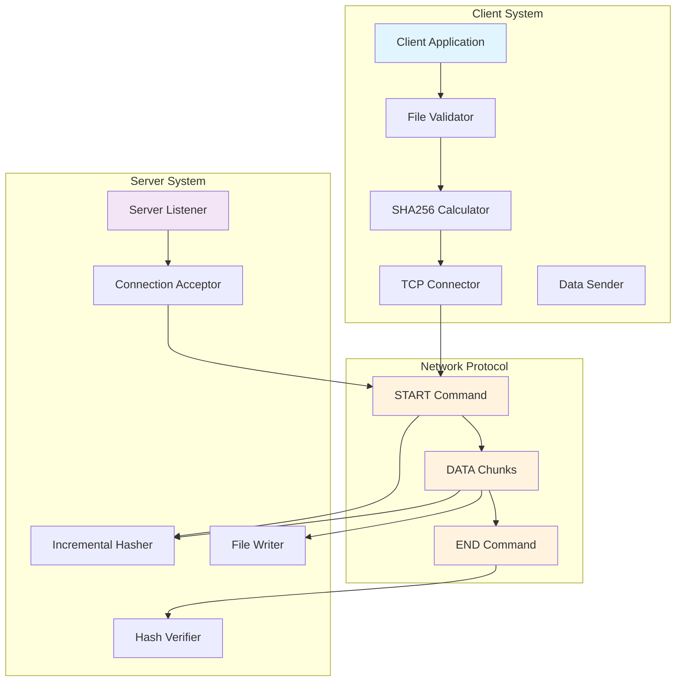
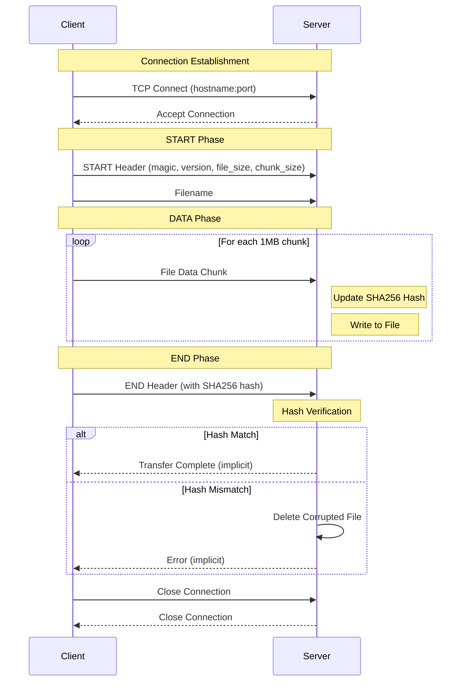
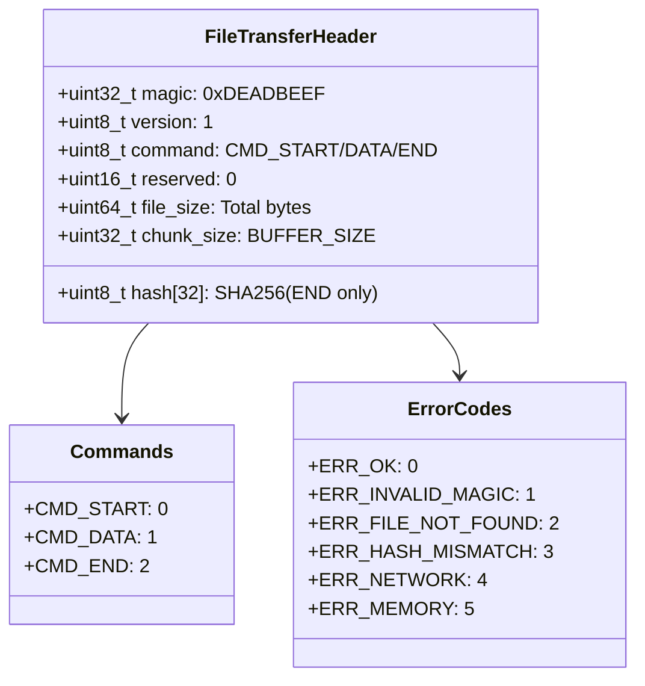

# Architecture Diagrams: TCP File Transfer Utility

This document contains pictorial representations of the file transfer utility architecture, complementing the detailed ARCHITECTURE.md document.

## 1. System Overview Diagram



## 2. Protocol Sequence Diagram



## 3. Component Architecture Diagram

```mermaid
graph TD
    subgraph "client.c"
        A1[main()]
        A2[send_file()]
        A3[File Validation]
        A4[Hash Calculation]
        A5[Connection Setup]
        A6[START Command]
        A7[Data Streaming]
        A8[END Command]
    end

    subgraph "common.c"
        B1[calculate_sha256()]
        B2[client_connect()]
        B3[print_hash()]
    end

    subgraph "server.c"
        C1[main()]
        C2[receive_file()]
        C3[Server Setup]
        C4[Connection Accept]
        C5[START Processing]
        C6[Data Reception]
        C7[Hash Verification]
        C8[File Management]
    end

    subgraph "common.c (Server)"
        D1[server_listen()]
        D2[print_hash()]
    end

    A1 --> A2
    A2 --> A3
    A2 --> A4
    A2 --> A5
    A2 --> A6
    A2 --> A7
    A2 --> A8

    A4 --> B1
    A5 --> B2
    A6 --> B3

    C1 --> C2
    C2 --> C3
    C2 --> C4
    C2 --> C5
    C2 --> C6
    C2 --> C7
    C2 --> C8

    C3 --> D1
    C7 --> D2

    style A1 fill:#bbdefb
    style C1 fill:#ce93d8
    style B1 fill:#81c784
    style D1 fill:#81c784
```

## 4. Data Flow Architecture Diagram

```mermaid
flowchart TD
    subgraph "Client Data Flow"
        F1[Input File]
        F2[File Stat Check]
        F3[Size Validation]
        F4[SHA256 Pre-calculation]
        F5[Create TCP Socket]
        F6[Connect to Server]
        F7[Send START Header]
        F8[Send Filename]
        F9[Open File for Reading]
        F10[Read 1MB Chunks]
        F11[Send Data Chunks]
        F12[Send END Header + Hash]
        F13[Close Connection]
    end

    subgraph "Server Data Flow"
        S1[Create Listen Socket]
        S2[Bind to Port]
        S3[Listen for Connections]
        S4[Accept Client Connection]
        S5[Receive START Header]
        S6[Validate Magic Number]
        S7[Receive Filename]
        S8[Create Output File]
        S9[Initialize SHA256 Context]
        S10[Receive Data Chunks]
        S11[Write to File]
        S12[Update Hash Context]
        S13[Receive END Header]
        S14[Finalize Hash]
        S15[Compare Hashes]
        S16{Success?}
        S17[Keep File]
        S18[Delete File]
        S19[Close Connection]
    end

    F1 --> F2
    F2 --> F3
    F3 --> F4
    F4 --> F5
    F5 --> F6
    F6 --> F7
    F7 --> F8
    F8 --> F9
    F9 --> F10
    F10 --> F11
    F11 --> F12
    F12 --> F13

    S1 --> S2
    S2 --> S3
    S3 --> S4
    S4 --> S5
    S5 --> S6
    S6 --> S7
    S7 --> S8
    S8 --> S9
    S9 --> S10
    S10 --> S11
    S11 --> S12
    S12 --> S13
    S13 --> S14
    S14 --> S15
    S15 --> S16
    S16 -->|Yes| S17
    S16 -->|No| S18
    S17 --> S19
    S18 --> S19

    style F1 fill:#e8f5e8
    style S1 fill:#fce4ec
    style S16 fill:#fff9c4
```



## 5. Protocol Header Structure



## Diagram Legend

### Colors Used:
- **Light Blue** (#e1f5fe, #bbdefb): Client components
- **Light Purple** (#f3e5f5, #ce93d8): Server components
- **Light Green** (#81c784): Shared/common components
- **Light Orange** (#fff3e0): Protocol messages
- **Light Green** (#e8f5e8): Input data
- **Light Pink** (#fce4ec): Server processes
- **Light Yellow** (#fff9c4): Decision points

### Flow Types:
- **Solid Arrows**: Data flow and function calls
- **Dashed Arrows**: Conditional paths
- **Loops**: Repeated operations (chunked data transfer)

These diagrams provide a visual representation of the TCP file transfer utility's architecture, showing the interaction between client and server components, the protocol flow, and the internal data processing pipelines.